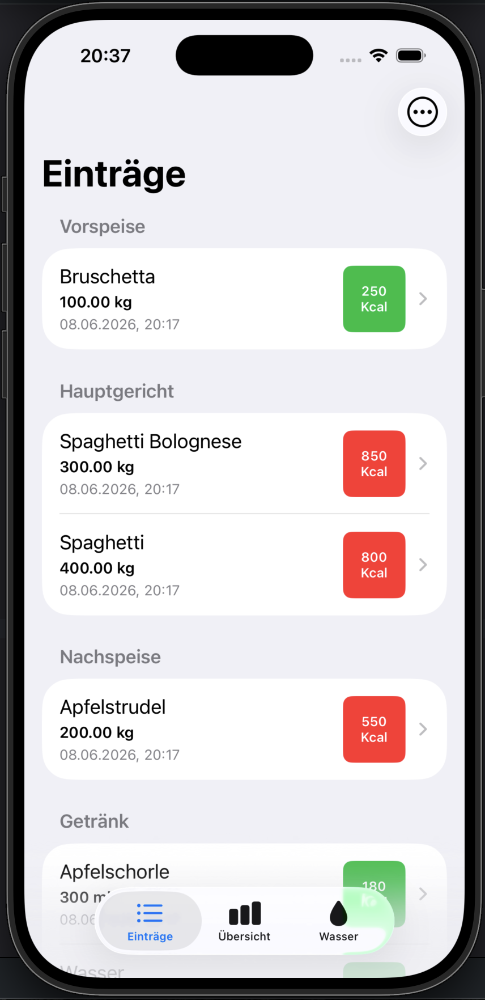
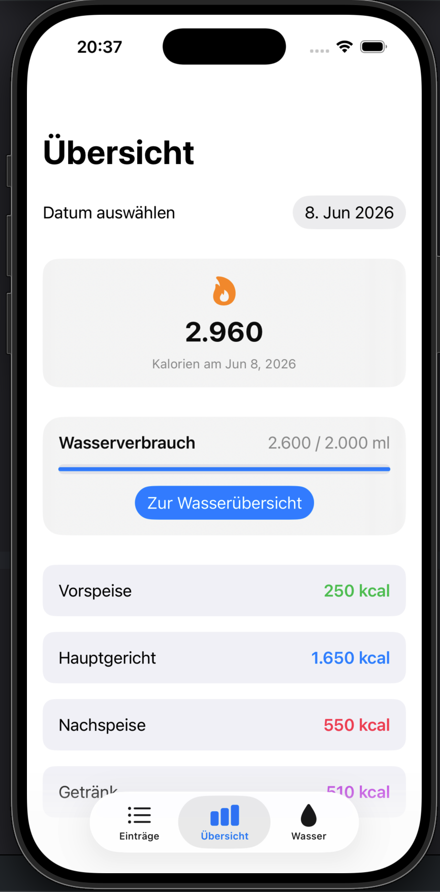
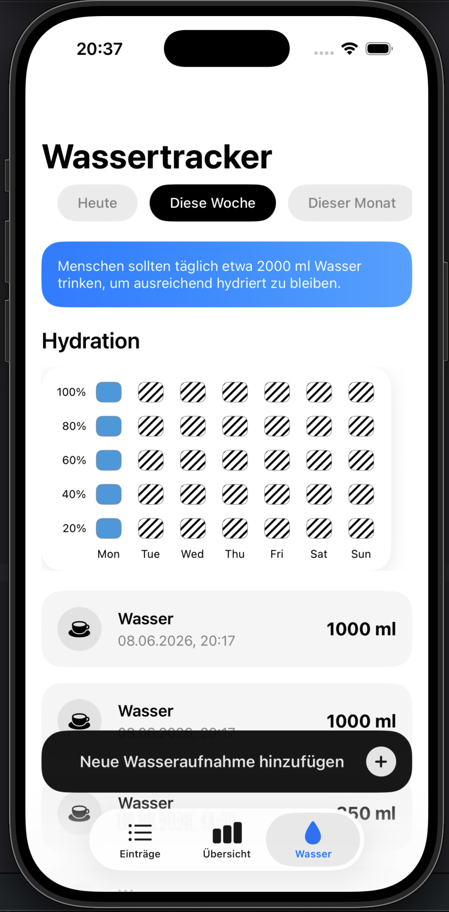
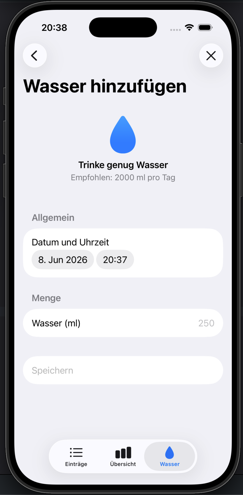
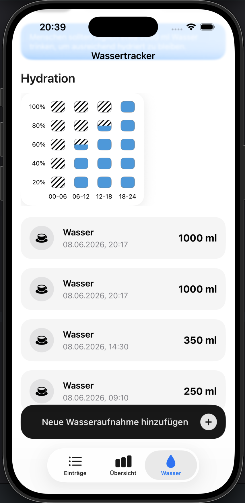

# 🍎 Food Tracker App – Week 3 Project

An iOS SwiftUI application that helps users track meals, calories, and daily water consumption through an intuitive and modern interface.

---

  
  &nbsp;
  
    &nbsp;
  
    &nbsp;
  
    &nbsp;
  

## 🧠 Project Idea

The goal of this project is to build a complete nutrition tracking application using SwiftUI while practicing navigation, forms, data management, reusable views, and user interactions.

Users can:

* Log meals and drinks
* Track daily calorie intake
* Monitor water consumption
* View nutrition statistics
* Access detailed meal information
* Add and delete entries

The project focuses on creating a clean user experience while applying fundamental and intermediate SwiftUI concepts.

---

## 🛠️ Tech Stack

* Swift
* SwiftUI
* Xcode
* NavigationStack
* TabView
* State Management (`@State`, `@Binding`)
* MVVM-inspired structure (Models / Views)

---

## 🧱 Project Structure

### Models

* Drink.swift
* DrinkDay.swift
* Entry.swift
* MealCategoryData

### Views

* RootView.swift
* WaterTrackerView.swift
* EntryView.swift
* DetailView.swift
* DashboardView.swift
* DayDetailView.swift

---

## ⚙️ Features

### 🍽️ Meal Tracking

* Create food entries dynamically
* Store meal information
* Track calorie intake
* Organize entries by category

Supported categories:

* 🍳 Appetizer
* 🍽️ Main Course
* 🍪 Dessert
* 🥤 Drinks

---

## 📋 EntryView

* Displays a list of all entries
* Swipe to delete individual entries
* Delete all entries with confirmation alerts

### 📋 AddEntrySheet

* Add new entries using Forms
* Input meal details such as title, date, category, weight and calories

### 📄 DetailView

* Dedicated detail screen for each meal
* Displays nutritional information
* Accessible through NavigationStack
* Allows viewing and editing of meal data

Information displayed:

* Title
* Date
* Category
* Weight
* Calories

---

## 📊 Dashboard Overview

### 📋 DashboardView

* Daily calorie summary
* Daily water intake
* Calories and water per day
* Quick overview of entries by date and category

Features:

* Today's total calories
* Aggregated meal data
* Visual statistics

---

### 💧 Water Tracker

* Track daily, weekly, monthly and yearly water consumption
* Add drinks to specific days
* Display a list of water entries
* Monitor hydration progress

---

### 🎨 Modern UI

* Tab-based navigation
* Forms and Sheets
* Custom list rows
* Responsive layouts
* SF Symbols integration
* Clean spacing and typography

---

## 📚 Concepts Practiced

* SwiftUI Layouts
* NavigationStack
* NavigationPath
* TabView
* Forms
* Alerts
* Sheets
* Lists & Sections
* State Management
* Data Binding
* Dynamic Calculations
* Reusable Components
* Model Design

---

## 🚀 Learning Goals

This project was created to practice:

* Building multi-screen SwiftUI applications
* Managing user-generated data
* Creating reusable views
* Implementing navigation patterns
* Working with forms and user input
* Structuring larger SwiftUI projects

---

## 🌟 Additional Features

Features implemented beyond the basic requirements:

* Dashboard with calorie calculations
* Water consumption tracker
* Multi-tab navigation
* Daily hydration monitoring
* Dynamic statistics
* Enhanced UI design

---

## 👨‍💻 Author

Developed as part of the Syntax Institute iOS Development Program using SwiftUI.
